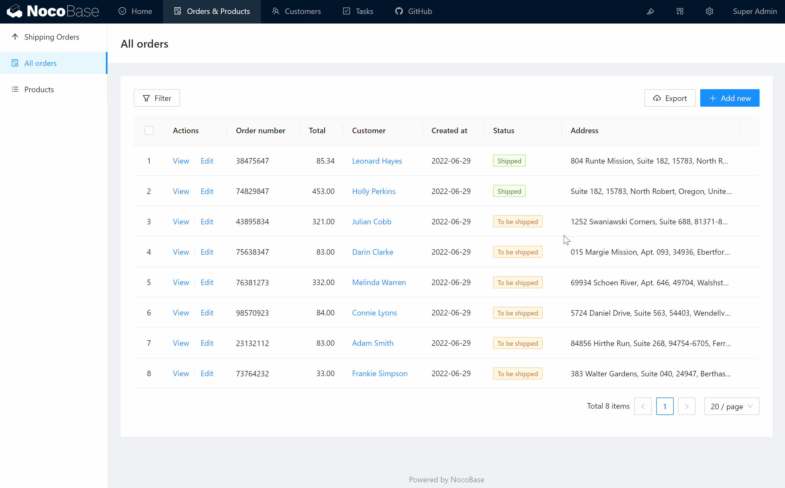

# UI Editor Mode

NocoBase uses a WYSIWYG approach to configure the interface. Click the `UI Editor` button in the upper right corner to switch between configuration mode and usage mode. Once you enter the configuration mode, many orange configuration portals will appear everywhere on the interface.

Usually, the configuration entry appears in the upper right corner of the element.

## Menu item configuration

Move the mouse over the menu item, in the upper right corner you can see the drag and drop sort button, configuration item button, you can edit, move, insert, delete.

## Block configuration

Move the mouse over a block and you will see drag-and-drop sort button, add block button and configure item button in the upper right corner.

Different blocks also have their own unique configuration items. For example, in the table block, you can see the configuration items of the table header in the upper right corner by hovering over the table header; you can also see the configuration items of the table columns in the far right side of the table header.

## Action configuration

In the block you can see the configuration entries for the actions, which appear in different places in different blocks.

For example, in the table block, the actions for the table data can be seen in the upper right:

In the table header of the actions column you can see the action for the single row of data: !

You can see the actions for the details in the upper right corner of the details block:

The actions for the form can be seen at the bottom of the form block:

## Tab configuration

Multiple tabs can be added in a popup or drawer to host different blocks.

